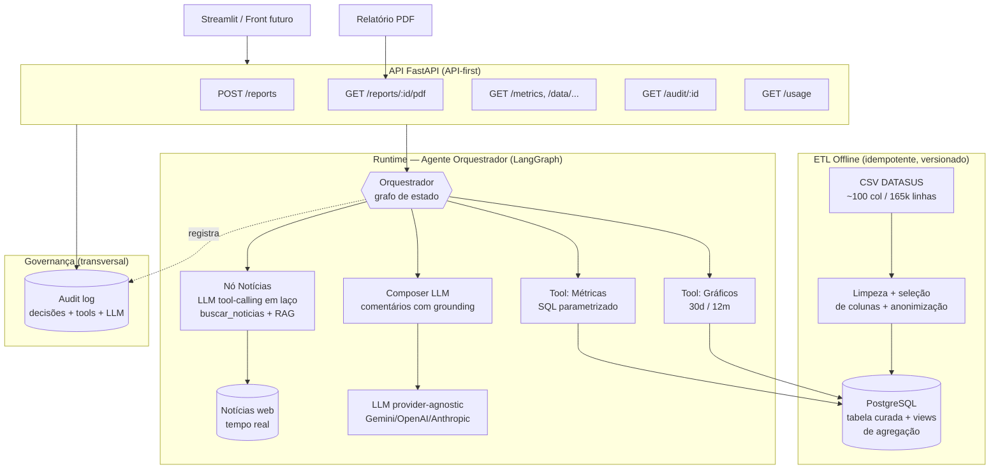
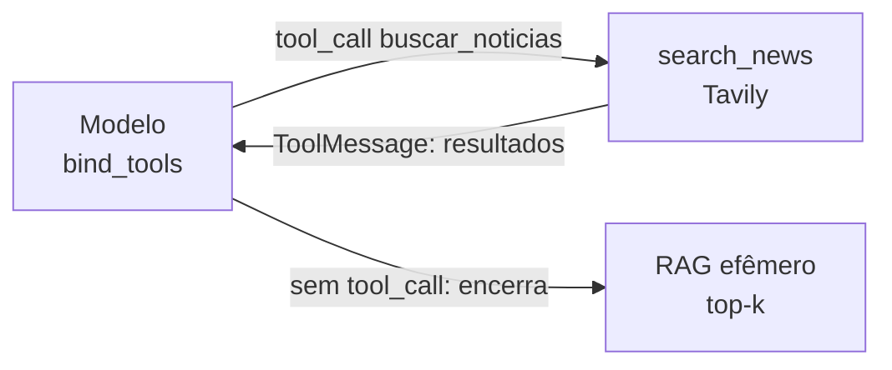

# Design — SRAG Report Agent

> Documento de arquitetura. Esta é a peça central para o critério **"Escolha da arquitetura"** e
> consolida as **justificativas de cada decisão** (formato ADR ao final). Respeita a
> `.kiro/steering/constitution.md`.

## 1. Visão geral da arquitetura

A solução é **API-first** e **agente-cêntrica**, com 4 camadas e uma separação rígida entre
preparação de dados (offline) e runtime do agente.

## 2. Componentes

### 2.1 Camada de ETL (offline)
Pipeline idempotente que baixa o CSV do DATASUS, **seleciona apenas as colunas pertinentes** às
métricas, corrige tipos/datas, trata ausências segundo regra documentada, **remove identificadores**
(P4) e carrega no Postgres em uma tabela curada (`srag_cases`) acompanhada de **views de agregação**
(diária e mensal) para acelerar métricas e gráficos.

Colunas candidatas (a confirmar contra o dicionário de dados — ver `tasks.md`): data dos sintomas /
data de internação, evolução do caso (óbito/cura), internação em UTI (sim/não), doses de vacina,
UF/município (somente para agregação regional), faixa etária e sexo (sensíveis → só agregados).

### 2.2 Banco de dados (PostgreSQL / Railway)
Fonte única de verdade do runtime. Acesso somente via `src/db/queries.py` com queries parametrizadas
de uma **whitelist** (P5). As 4 métricas têm cada uma sua função SQL versionada (P1).

### 2.3 Agente orquestrador (LangGraph)
Grafo de estado com nós: `gather_metrics` → `gather_charts` → `gather_news` (com RAG) →
`compose_report`. O estado tipado carrega métricas, caminhos dos gráficos, notícias (com fonte) e o
rascunho do comentário. Cada transição é um ponto natural de **checkpoint e auditoria** (P2). As tools:

| Tool | Entrada | Saída | Guardrail |
|---|---|---|---|
| `metrics_tool` | janela temporal | 4 métricas + valores brutos | só queries da whitelist (P5) |
| `chart_tool` | série diária/mensal | 2 imagens PNG | dados vêm das views (P1) |
| `buscar_noticias` (LLM tool) | query de busca | lista {título, url, data, trecho} | janela de recência + atribuição (P3) |

**Grau de agência (decisão consciente) — abordagem híbrida.** Métricas e gráficos são
**determinísticos** (não há agência sobre números). A agência do LLM existe **apenas no nó de
notícias**, e aí ela é **real**: a busca é exposta como uma **ferramenta chamável pelo modelo**
(`bind_tools` → `buscar_noticias`). O nó roda um **laço de *tool-calling*** (modelo ⇄ ferramenta): o
LLM formula a query, lê os resultados e **decide por conta própria** se a busca foi suficiente ou se
refina e busca de novo, até um **limite de iterações** (`NEWS_AGENT_MAX_ITERS`). É "agente de verdade"
onde é seguro, sem abrir mão do determinismo e da auditabilidade onde importa (ADR-09/ADR-11).

Cada iteração — a query pedida pelo modelo e a contagem de resultados — é registrada no trilho de
auditoria (R4.8/P2). Ao encerrar o laço, os artigos acumulados (deduplicados) passam pelo **RAG
efêmero** (§2.4) para selecionar o top-k relevante. Se o *tool-calling* falhar (modelo sem suporte,
cota), o nó **degrada** para a busca determinística (query formulada/padrão) preservando R4.4/R4.7.

### 2.4 RAG efêmero sobre as notícias
O `gather_news` não joga todos os resultados crus no prompt. Ele monta um **RAG efêmero por
requisição**: (1) os trechos retornados pelo Tavily são **embeddados** (embeddings do provedor, ex.
Gemini `text-embedding`), (2) carregados num **`InMemoryVectorStore`** (LangChain, em memória, sem
infra persistente), (3) recupera-se o **top-k** mais relevante ao cenário das métricas. O índice é
**reconstruído a cada relatório e descartado** — adequado a notícia efêmera/tempo real e sem custo de
manter um vector DB.

### 2.5 Composer / LLM (provider-agnostic)
Nó final que recebe as métricas e os trechos de notícia **recuperados (top-k)** e gera o relatório
**com saída estruturada** (Pydantic) e **grounding obrigatório**. Estrutura da saída: para **cada uma
das 4 métricas**, uma explicação contextual própria ancorada na métrica e/ou em notícia citada
(atende "métricas e as **respectivas** explicações"), mais uma síntese geral do cenário. O prompt
inclui os guardrails de saída (disclaimer de PoC/não-orientação-médica). A LLM é acessada por
`src/agent/llm.py` via `init_chat_model`, permitindo troca de provedor por env var (P8).

### 2.6 Governança / Auditoria (transversal)
`src/governance/audit.py` intercepta toda chamada de tool e LLM, persistindo em tabela `audit_log`
(ou JSONL) o trilho: requisição → parâmetros → resultados → fontes → id do relatório. Exposto por
`GET /audit/{id}`.

### 2.7 API (FastAPI) e interface
API-first: o relatório é um recurso. Endpoints:
- `POST /reports` → gera relatório (JSON: métricas, gráficos, comentários, fontes, audit_id).
- `GET /reports/{id}` / `GET /reports/{id}/pdf` → recupera / exporta PDF.
- `GET /metrics`, `GET /data/daily`, `GET /data/monthly` → agregados para front futuro.
- `GET /audit/{id}` → trilho de auditoria.

**Segurança da fronteira (guardrail HTTP).** Um middleware aplica: **API key** (`X-API-Key`, segredo
via env), **rate limiting** (`slowapi` — também limita custo de LLM) e **CORS** restrito. Não há
autenticação de usuários (fora de escopo). O Streamlit envia a API key a partir da sua própria env.

O **Streamlit é apenas um cliente** desses endpoints (R8.4) — exatamente a mesma fronteira que um
front-end customizado futuro usaria. Isso satisfaz o requisito de "deixar os endpoints prontos".

### 2.8 Observabilidade de uso e custo (transversal)
`src/governance/usage.py` define um **`UsageTracker`** que acompanha, por relatório, o consumo dos dois
recursos pagos: **LLM** (nº de chamadas e tokens de entrada/saída, lidos do `usage_metadata` de cada
resposta) e **busca Tavily** (nº de buscas). A partir de **tarifas configuráveis** (`src/config.py`,
P7) calcula um **custo estimado em USD** — explicitamente uma estimativa. O resultado é (a) anexado ao
JSON do relatório (`usage`), (b) registrado no trilho de auditoria e (c) **agregado** via `GET /usage`
(totais + últimos relatórios), permitindo acompanhar o gasto acumulado. Atende R10.x e o princípio P9.

## 3. Fluxo de uma requisição de relatório
1. Cliente chama `POST /reports`.
2. API instancia o grafo LangGraph com um `report_id` e abre o contexto de auditoria.
3. `gather_metrics` executa as 4 queries parametrizadas → métricas determinísticas.
4. `gather_charts` gera os 2 gráficos a partir das views.
5. `gather_news`: o LLM, com a ferramenta `buscar_noticias` vinculada (`bind_tools`), roda um **laço
   de *tool-calling*** — formula a query, lê os resultados do Tavily (fonte/data) e **decide se refina
   e busca de novo**, até o limite de iterações; cada iteração é auditada (R4.8). Os artigos acumulados
   são embeddados num `InMemoryVectorStore` e recupera-se o top-k relevante (RAG efêmero). Falha de
   *tool-calling* degrada para busca determinística (R4.7).
6. `compose_report` chama o LLM para gerar, **por métrica**, a explicação ancorada, mais a síntese —
   com grounding e disclaimer.
7. O **`UsageTracker`** consolida tokens/chamadas de LLM e buscas Tavily da requisição, com custo
   estimado (§2.8). Resultado persistido (incl. `usage`); auditoria fechada; JSON retornado (PDF sob
   demanda em `/pdf`).

## 4. Tratamento de dados sensíveis (resumo P4)
- Seleção mínima de colunas + descarte de identificadores na ETL.
- Microdados nunca saem do banco: API e LLM só recebem **agregados**.
- Atributos demográficos (idade, sexo, município) tratados apenas em forma agregada.
- Alinhamento com LGPD: minimização, finalidade e ausência de exposição individual.

## 5. Estratégia de testes
- Unitários nas **queries de métricas** (dados sintéticos com resultado conhecido) → garante P1.
- Unitários na **ETL** (linhas sujas → saída esperada).
- Teste de **guardrail SQL** (query fora da whitelist é rejeitada).
- Teste de **grounding** (comentário sem fonte é descartado/marcado).

---

## 6. Decisões Arquiteturais (ADRs)

### ADR-01 — SDD com estrutura Kiro + constitution do Spec Kit
**Decisão:** usar os artefatos do Kiro (`requirements`/`design`/`tasks` em EARS) e incorporar uma
`constitution.md` (conceito do GitHub Spec Kit) como steering de governança.
**Alternativas:** Spec Kit puro (mais cerimônia/comandos), BMAD (orientado a papéis de agentes).
**Porquê:** os 3 artefatos do Kiro mapeiam 1:1 nos critérios de avaliação e são leves para 5 dias;
o `design.md` é o lugar natural da justificativa arquitetural (critério mais pesado). A constitution
cobre a lacuna do Kiro em "princípios de governança/guardrails/dados sensíveis", que valem 3 dos 6
critérios. Spec Kit puro adiciona cerimônia sem ganho proporcional numa PoC.

### ADR-02 — LangGraph como orquestrador (vs AgentExecutor / CrewAI)
**Decisão:** LangGraph.
**Porquê:** o desafio cobra "registro de decisões dos agentes". O grafo de estado explícito torna
cada etapa um nó auditável e checkpointável, o que é difícil de evidenciar com o AgentExecutor
(trace opaco) ou CrewAI (internals abstraídos). Custo: mais boilerplate — aceitável pelo ganho em
governança/transparência (P2).

### ADR-03 — Métricas determinísticas via SQL parametrizado (vs SQL gerado pelo LLM)
**Decisão:** o LLM não calcula nem escreve SQL; usa funções/queries versionadas.
**Alternativa:** text-to-SQL (LLM gera a query).
**Porquê:** num relatório de surto, um número alucinado é inaceitável. SQL parametrizado é auditável,
reproduzível e seguro (sem injeção). Text-to-SQL traria risco de erro numérico e de query perigosa,
contra P1 e P5.

### ADR-04 — LLM provider-agnostic com default Gemini 2.5 Flash
**Decisão:** abstrair o LLM (`init_chat_model`); default Gemini 2.5 Flash.
**Porquê:** a assinatura Claude Pro **não** inclui API (billing separado). Gemini tem free tier
generoso (1.500 req/dia, function calling, sem cartão) → builda a PoC a custo zero. A abstração
permite migrar para Claude/OpenAI por env var na reta final, sem retrabalho (P8).

### ADR-05 — PostgreSQL no Railway (vs DuckDB / SQLite)
**Decisão:** Postgres gerenciado pelo Railway.
**Porquê:** one-click no Railway, separa ETL de runtime (P6), e materializa a "tool de consulta ao
banco" exigida com uma narrativa de arquitetura realista. DuckDB seria ótimo e zero-infra, mas a
história de "banco de dados" no diagrama e o caminho para um front futuro ficam mais claros com
Postgres. SQLite foi descartado por desempenho analítico fraco em 165k linhas.

### ADR-06 — API-first (FastAPI) com Streamlit como cliente
**Decisão:** FastAPI é o núcleo; Streamlit consome a API; PDF é um endpoint.
**Alternativa:** Streamlit acessando o banco direto (mais rápido, menos desacoplado).
**Porquê:** o usuário quer deixar endpoints prontos para um front-end futuro e para export de PDF.
Tornar o relatório um recurso de API desacopla a apresentação e permite que Streamlit hoje e um
front custom amanhã usem a mesma fronteira (R8.3/R8.4). Custo: uma camada a mais — justificada pela
extensibilidade pedida.

### ADR-07 — Tavily como tool de notícias (vs NewsAPI / scraping)
**Decisão:** Tavily.
**Porquê:** API de busca desenhada para agentes, retorna trechos já com fonte e data — direto para
o grounding (P3). NewsAPI/scraping exigiriam mais tratamento e teriam atribuição menos confiável.

### ADR-08 — RAG efêmero sobre as notícias (vs sem RAG / vector DB persistente)
**Decisão:** embeddar os trechos retornados pelo Tavily num `InMemoryVectorStore` por requisição e
recuperar o top-k relevante; índice descartado ao fim.
**Alternativas:** (a) sem RAG — jogar todos os trechos no prompt; (b) vector DB persistente
(Chroma/pgvector/FAISS em disco).
**Porquê:** atende o pré-requisito de "banco vetorial/RAG" demonstrando a técnica de fato, mas sem
infra: notícia é **efêmera** e específica de cada relatório, então um índice persistente envelheceria
e agregaria operação sem ganho. Embeddings em memória + retrieve top-k melhora o sinal (filtra ruído)
mantendo a imagem leve (sem `faiss`/`chroma`; usa `InMemoryVectorStore` do LangChain).

### ADR-09 — Agência restrita ao nó de notícias (vs determinístico total / ReAct livre)
**Decisão:** o LLM tem agência apenas no nó de notícias (formular/refinar/repetir a busca); métricas e
gráficos permanecem determinísticos.
**Porquê:** dá comportamento genuinamente "agêntico" onde é seguro (formular boa query é tarefa de
linguagem), sem expor os números à variabilidade do modelo. Um ReAct de escolha livre de tools seria
mais difícil de auditar e garantir guardrails (contra P1/P2/P5); o determinístico total seria pouco
agêntico para o enunciado.
**Como a agência é realizada:** ver ADR-11 (passou de "formular query + 1 refino" para um laço de
*tool-calling* de verdade, mantendo o mesmo escopo restrito).

### ADR-10 — Segurança mínima da API (vs autenticação de usuários / API aberta)
**Decisão:** middleware com API key + rate limiting + CORS; **sem** autenticação de usuários.
**Porquê:** uma API que dispara LLM exposta sem proteção é um furo de guardrail e de custo. A proteção
mínima fecha isso e pontua em "Guardrails". Já um sistema de login/cadastro/roles seria **fuga ao
escopo** (o desafio não tem gestão de usuários) e consumiria tempo sem ser avaliado.

### ADR-11 — Notícias via *tool-calling* do LLM (vs query única + 1 refino)
**Decisão:** o nó de notícias expõe a busca como **ferramenta chamável** (`bind_tools`) e roda um
**laço de raciocínio** (modelo ⇄ ToolNode manual): o LLM emite chamadas `buscar_noticias`, lê os
`ToolMessage` de resposta e decide encerrar ou refinar, até `NEWS_AGENT_MAX_ITERS`.
**Alternativas:** (a) a versão anterior — o LLM só devolvia uma string de query e o código fazia 1
refino fixo; (b) ReAct livre com várias tools (descartado em ADR-09).
**Porquê:** demonstra **uso de tools de verdade** (o modelo *decide* chamar a ferramenta e itera com
base no resultado), critério explícito do desafio, sem ampliar a superfície de risco — a ferramenta é
**uma só** e somente de leitura (busca), os números seguem determinísticos (P1), e cada iteração é
auditada (R4.8/P2). Mantém-se o escopo de ADR-09. Custo: +1–2 chamadas de LLM por relatório (limitadas
e contabilizadas em §2.8) e fallback determinístico se o provedor não suportar tools (R4.7).

### ADR-12 — Observabilidade de uso/custo (vs sem medição / billing externo)
**Decisão:** um `UsageTracker` interno mede tokens de LLM (via `usage_metadata`) e buscas Tavily por
relatório e estima o custo com **tarifas configuráveis**; exposto no relatório, na auditoria e em
`GET /usage`.
**Alternativas:** (a) não medir; (b) depender só dos painéis de billing de Google/Tavily.
**Porquê:** uma PoC agêntica que dispara LLM e busca precisa tornar o **gasto visível e auditável** —
reforça governança (P2) e controle de custo (já endereçado por rate limit em ADR-10). Medir no próprio
processo dá granularidade por relatório que o billing externo não oferece, a custo de manter tarifas de
referência atualizáveis por env (P7). É **estimativa**, não fatura — e é rotulada como tal.
