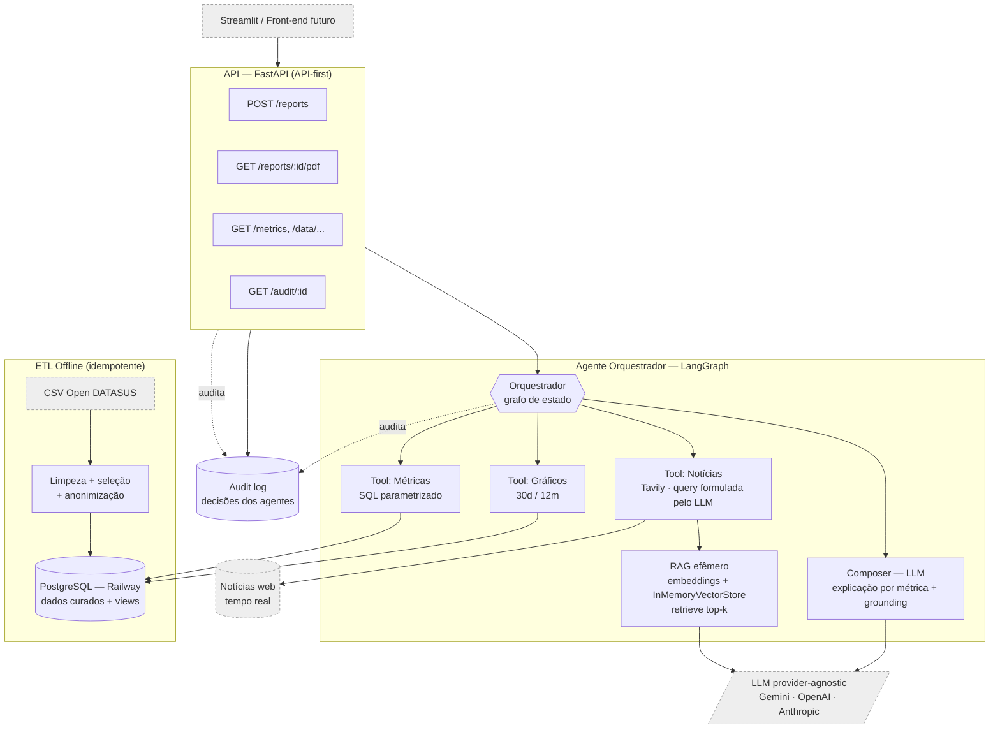

# Diagrama Conceitual — SRAG Report Agent

Fonte do diagrama exigido na entrega (Agente Principal/Orquestrador, Tools, LLM, banco e fontes de
notícias). Exportar para PDF antes de submeter (ver instruções ao final).



## Como exportar para PDF

Opção rápida (sem instalar nada): colar o bloco acima em <https://mermaid.live>, exportar SVG/PNG e
"imprimir para PDF". Ou via CLI:

```bash
npm install -g @mermaid-js/mermaid-cli
mmdc -i docs/architecture/architecture.md -o docs/architecture/architecture.pdf
```
