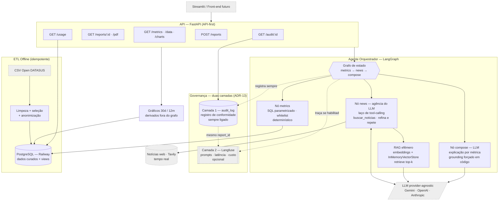

# Diagrama Conceitual — SRAG Report Agent

Fonte do diagrama exigido na entrega (Agente Principal/Orquestrador, Tools, LLM, banco e fontes de
notícias). Exportar para PDF antes de submeter (ver instruções ao final).


```mermaid
flowchart TB
    UI[Streamlit / Front-end futuro]:::ext

    subgraph API["API — FastAPI (API-first)"]
        R1[POST /reports]
        R2[GET /reports/:id · /pdf]
        R3[GET /metrics · /data · /charts]
        R4[GET /audit/:id]
        R5[GET /usage]
    end

    subgraph AGENT["Agente Orquestrador — LangGraph"]
        ORCH{{Grafo de estado<br/>metrics → news → compose}}
        T1[Nó metrics<br/>SQL parametrizado · whitelist<br/>determinístico]
        T3[Nó news — agência do LLM<br/>laço de tool-calling<br/>buscar_noticias · refina e repete]
        RAG[RAG efêmero<br/>embeddings + InMemoryVectorStore<br/>retrieve top-k]
        T4[Nó compose — LLM<br/>explicação por métrica<br/>grounding forçado em código]
    end

    T2[Gráficos 30d / 12m<br/>derivados fora do grafo]

    LLM[/LLM provider-agnostic<br/>Gemini · OpenAI · Anthropic/]:::ext
    DB[(PostgreSQL — Railway<br/>dados curados + views)]
    NEWS[(Notícias web · Tavily<br/>tempo real)]:::ext

    subgraph GOV["Governança — duas camadas (ADR-13)"]
        AUDIT[(Camada 1 — audit_log<br/>registro de conformidade<br/>sempre ligado)]
        TRACE[[Camada 2 — Langfuse<br/>prompts · latência · custo<br/>opcional]]:::ext
    end

    subgraph ETL["ETL Offline (idempotente)"]
        CSV[CSV Open DATASUS]:::ext --> CLN[Limpeza + seleção<br/>+ anonimização] --> DB
    end

    UI --> API
    API --> ORCH
    API --> T2 --> DB
    ORCH --> T1 --> DB
    ORCH --> T3 --> NEWS
    T3 <--> LLM
    T3 --> RAG --> LLM
    ORCH --> T4 --> LLM
    ORCH -.registra sempre.-> AUDIT
    ORCH -.traça se habilitado.-> TRACE
    AUDIT -.mesmo report_id.-> TRACE
    R4 --> AUDIT
    R5 --> DB

    classDef ext fill:#eee,stroke:#999,stroke-dasharray:4 3;
```

**Leitura do diagrama.** O determinismo está do lado esquerdo: métricas e gráficos saem de SQL
parametrizado, sem LLM no caminho. A **agência** está restrita ao nó `news`, onde o modelo decide
quais termos buscar e quando parar (seta bidirecional com o LLM). O nó `compose` interpreta, mas
não calcula. Toda decisão desce para a camada 1 obrigatoriamente; a camada 2 é opcional e some sem
afetar nada.

```

## Como exportar para PDF

Opção rápida (sem instalar nada): colar o bloco acima em <https://mermaid.live>, exportar SVG/PNG e
"imprimir para PDF". Ou via CLI:

```bash
npm install -g @mermaid-js/mermaid-cli
mmdc -i docs/architecture/architecture.md -o docs/architecture/architecture.pdf
```
